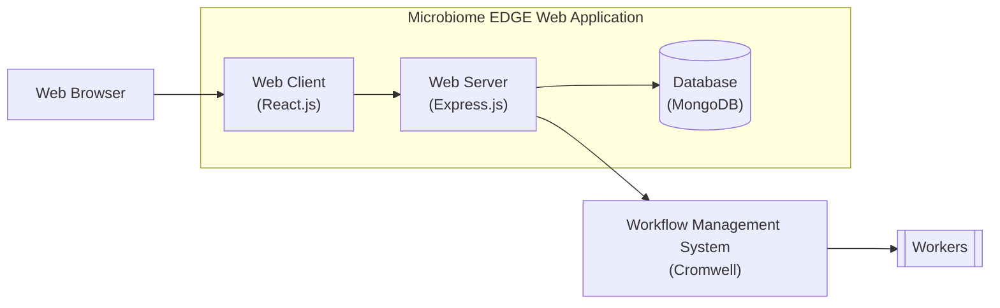

# microbiome-edge
Version 1.0

This repository contains the source code of the Microbiome EDGE web application. 

The Microbiome EDGE web application is the web-based interface through which researchers can access the Microbiome EDGE platform. 
The Microbiome EDGE platform is a [Cromwell](https://cromwell.readthedocs.io/en/stable/)-based system researchers can use to
process omics data using standardized bioinformatics workflows.

## Architecture

Here's a diagram depicting the architecture of the Microbiome EDGE platform,
including how the Microbiome EDGE web application fits into it.

Here's a list of the main technologies upon which the Microbiome EDGE web application is built:

- [React.js](https://react.dev/) (web client)
- [Node.js](https://nodejs.org/en) + [Express.js](https://expressjs.com/) (web server)
- [MongoDB](https://www.mongodb.com/) (database)

